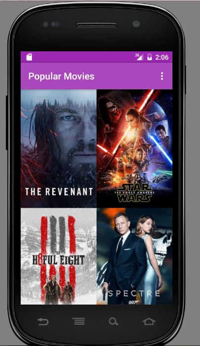
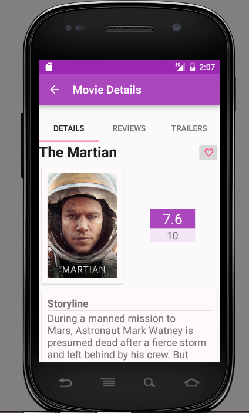
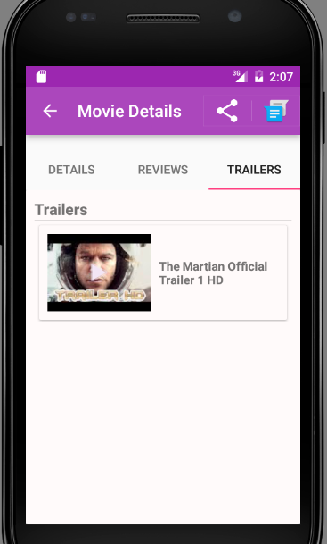
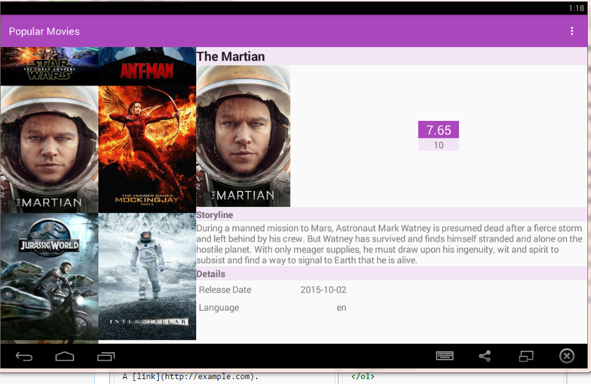

Popular Movie App
============================

- To fetch popular movies, you will use the API from themoviedb.org.
If you do not have an account, create one in order to request an API Key
- **Update MOVIE_APP_KEY** with API Key prior building project

> buildTypes.all { variant ->
        variant.buildConfigField "String", "THE_MOVIE_DB_API_KEY",
                '"**MOVIE_APP_KEY**"'
    }

Screen Shots
----------

######External Libraries used
- picasso
- OkHttp
- ormlite
- lombok
- gson