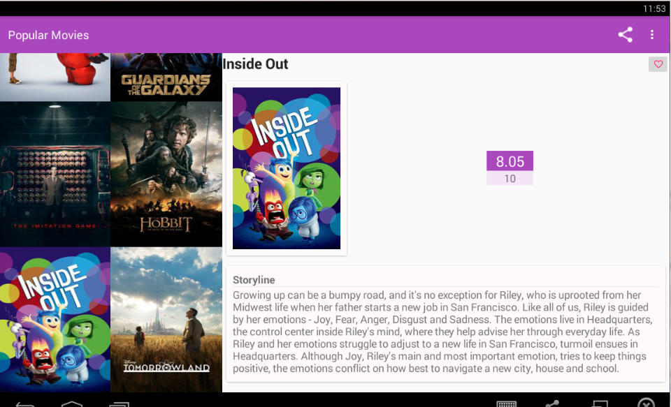

Popular Movie App(Project-1)
============================

- To fetch popular movies, you will use the API from themoviedb.org.
If you don�t already have an account, you will need to create one in order to request an API Key
- Update MOVIE_APP_KEY with API Key prior building project 

buildTypes.all { variant ->
        variant.buildConfigField "String", "THE_MOVIE_DB_API_KEY",
                '"MOVIE_APP_KEY"'
    }

Screen Shots
-----------

